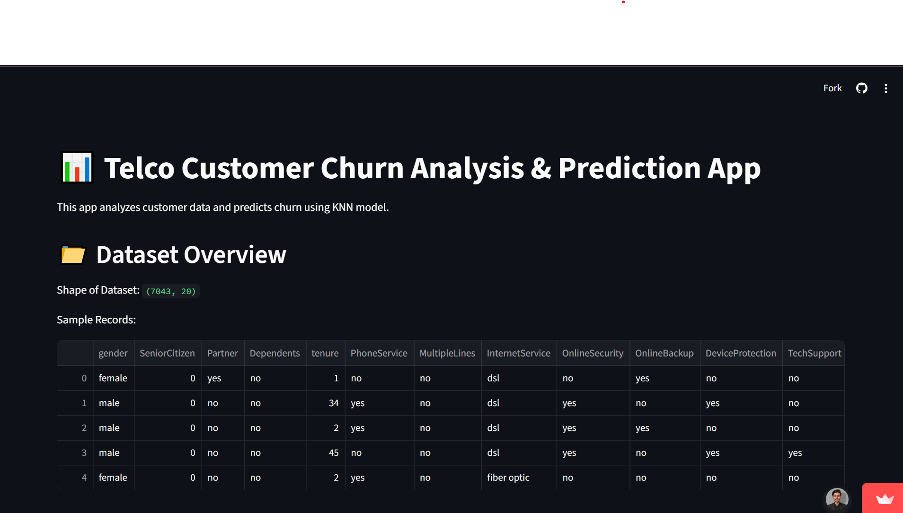
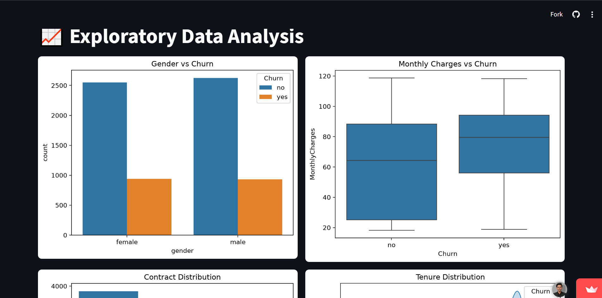
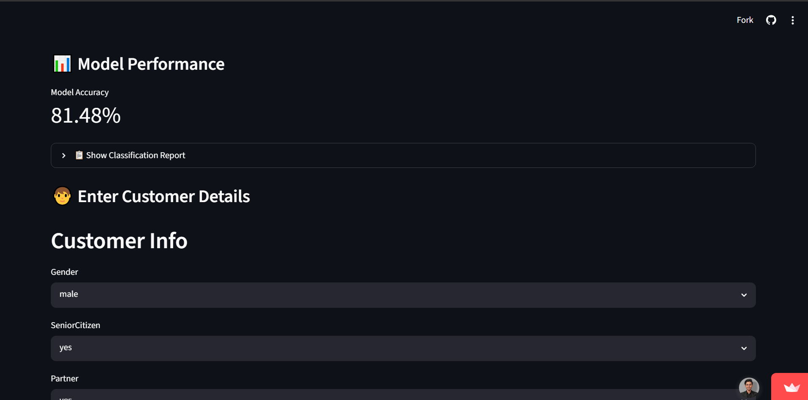
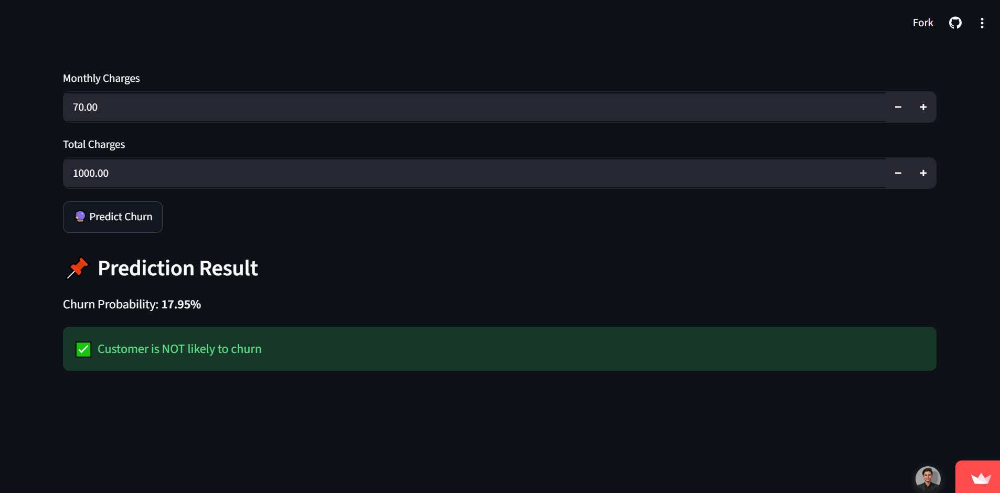

# 📊 Telco Customer Churn Prediction

A Machine Learning web application that predicts customer churn using a trained classification model with an interactive Streamlit interface.

---

## 📖 Project Overview

This project explores customer churn prediction through data preprocessing, exploratory data analysis, feature engineering, model training, and deployment with Streamlit.

---

## ✨ Features

- Interactive Streamlit Dashboard
- Exploratory Data Analysis
- Customer Churn Prediction
- Model Evaluation
- Feature Engineering

---

## 🛠 Tech Stack

- Python
- Streamlit
- Scikit-learn
- Pandas
- NumPy
- Matplotlib

---

## 📂 Project Structure

```text
telco-churn-streamlit-app/
app.py
ohe_encoder.pkl
Telco-Customer-Churn.csv
requirements.txt
README.md
```

---

## 💻 Installation

```bash
pip install -r requirements.txt

streamlit run app.py
```

---

## 🚀 Live Demo

[(Add your Streamlit link)](https://telco-churn-app-devsparkcodes.streamlit.app/)

---

## 📸 Screenshots

- Home Page
- EDA
- Model Performance
- Prediction Result

## 📸 Screenshots

### Home Page



### Exploratory Data Analysis



### Model Performance



### Prediction Result



---

## 🎯 Learning Outcomes

- Data Cleaning
- Feature Engineering
- Classification Models
- Streamlit Deployment

---

## 🔮 Future Improvements

- Multiple ML Models
- Explainable AI
- Model Comparison
- Cloud Deployment

---

## 👨‍💻 Author

Muhammad Umar
